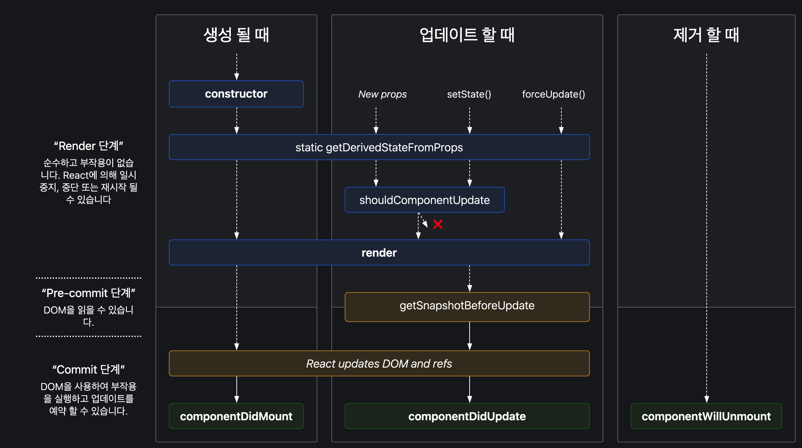

# 리액트 라이프사이클
> React의 컴포넌트가 시간의 흐름에 따라 **생성**되고, **업데이트** 되다가 **사라지는** 과정을 말합니다. Mount, Update, Unmount 세 단계로 나눌 수 있으며, 각 단계마다 생명주기 메서드를 통해 원하는 작업을 수행할 수 있습니다. 

> 컴포넌트는 화면에 추가될 때 마운트 됩니다. 컴포넌트는 일반적으로 상호작용에 대한 응답으로 새로운 props나 state를 수신하면 업데이트 됩니다.
컴포넌트가 화면에서 제거되면 마운트가 해제 됩니다.

## 클래스 컴포넌트의 생명주기 메서드에 대해 설명해주세요.

**1. componentDidMount**
- 컴포넌트가 생성된 직후에 호출되는 메서드 입니다.
- API를 호출하거나, 이벤트 리스너를 추가하는 등의 작업을 수행할 때 많이 사용합니다.

**2. componentDidUpdate**
- 컴포넌트가 업데이트된 직후에 호출되는 메서드 입니다.
- 화면에 출력되는 화면 구성을 변경하고자 할 때 많이 사용합니다.

**3. componentWillUnmount**
- 컴포넌트가 제거되기 직전에 호출되는 메서드 입니다.
- 컴포넌트의 동작을 위해 사용되었던 메소드들의 리소스를 제거해줄 때 사용합니다. 타이머나 이벤트 리스너를 제거하는 cleanup Function을 호출하는 경우가 많습니다.

## 클래스 컴포넌트의 생명주기 메서드를 함수형 컴포넌트에서도 활용할 수 있는 훅은 무엇인가요? 
> useEffect입니다. 클래스 컴포넌트의 생명주기 메소드 중 componentDidMount, componentDidUpdate, componentWillUnmount, getDerivedStateFromProps를 대체할 수 있습니다.

> 의존성 배열을 빈 배열로 사용하면, componentDidMount처럼 최초 렌더링 시에만 실행됩니다. 의존성 배열에 state를 추가하면 componentDidMount와 같이 최초 렌더링시 뿐만 아니라, state가 변경될 때마다 실행됩니다. 이는 componentDidUpdate, getDerivedStateFromProps의 역할을 수행하는 것과 같습니다. 
의존성 배열없이 사용하면, 세가지 (생성, 업데이트, 언마운트) 경우에 모두 실행이 됩니다. 

## useEffect 와 useLayoutEffect 의 차이점은 무엇인가요?
> useEffect는 비동기적으로 실행됩니다. render와 paint가 모두 끝난 후 실행되기 때문에 DOM에 영향을 주는 코드가 있으면 사용자 입장에서는 화면의 깜빡임을 봅니다.

> useLayoutEffect는 render 된 후 실행되고, 실행이 종료되면 paint가 됩니다. 동기적으로 실행되며, paint 이전에 실행되기 때문에 DOM을 조작하는 코드가 존재하더라도 사용자는 화면의 깜빡임을 느끼지 않습니다.


---

# 설명



### 1. 생성될 때 (Mount)
- constructor
- componentWillMount
- render
- componentDidMount

### 2. 업데이트될 때 (Update)
> 업데이트는 props나 state가 변경되었을 때 발생한다.
- shouldComponentUpdate
- componentWillUpdate
- render
- componentDidUpdate

### 3. 제거될 때 (Unmount)
> 상위 컴포넌트가 하위 컴포넌트를 더이상 그리지 않을 때, unmount 된다.
- componentWillUnmount

### componentDidMount
- 컴포넌트가 모두 구성된 직후에 `componentDidMount`가 호출된다. 이 메서드는 컴포넌트가 렌더링된 직후에 호출된다. 이 시점에서는 DOM 노드에 접근할 수 있으며, 이벤트 리스너를 추가하거나 네트워크 요청을 보내는 등의 작업을 수행할 수 있다.
- API 호출을 수행하면 효과적이다.

### componentDidUpdate
- 컴포넌트가 업데이트된 직후에 `componentDidUpdate`가 호출된다. 이 메서드는 컴포넌트가 업데이트된 직후에 호출된다. 이 시점에서는 이전의 props와 state를 접근할 수 있으며, 이를 통해 컴포넌트가 업데이트되기 전과 후를 비교하여 필요한 작업을 수행할 수 있다.
- 화면에 출력되는 화면 구성을 변경하고자 할 때 많이 사용한다. 그러나 데이터 변경과 관련한 함수를 클라이언트가 직접 처리하는 경우는 많지 않다. 

### componentWillUnmount
- 컴포넌트가 제거되기 직전에 `componentWillUnmount`가 호출된다. 이 메서드는 컴포넌트가 제거되기 직전에 호출된다. 이 시점에서는 컴포넌트가 제거되기 전에 필요한 작업을 수행할 수 있다. 이 메서드는 컴포넌트가 제거되기 직전에 호출되기 때문에, 이벤트 리스너를 제거하거나 네트워크 요청을 취소하는 등의 작업을 수행할 수 있다.
- 컴포넌트의 동작을 위해 사용되었던 메소드들의 리소스를 제거해줄 때 사용한다. 어플리케이션 성능 향상을 위해 사용되는 경우가 많다.

### useEffect로 구현하는 생명주기 메서드

1️⃣ useEffect(callBackFunc);
2️⃣ useEffect(callBackFunc, []);
3️⃣ useEffect(callBackFunc, [state1, state2]);
4️⃣ useEffect(()=>{ return(() => func()) });

1. All

2. componentDidMount
```jsx
useEffect(()=>{
	console.log("componentDidMount");     
},[])
```

3. componentDidMount + componentDidUpdate
```jsx
useEffect(() => {
	console.log("count or exampleProp changed");     
},[count, exampleProp]);
```

4. componentWillUnmount
```jsx
useEffect(()=>{
	console.log("componentDidMount");
    return(() => exampleAPI.unsubscribe()); // componentWillUnmount
})
```


### useEffect와 useLayoutEffect

> useLayoutEffect 는 동기적으로 실행되고 내부의 코드가 모두 실행된 후 painting 작업을 거칩니다. 따라서 로직이 복잡할 경우 사용자가 레이아웃을 보는데까지 시간이 오래걸린다는 단점이 있어, 기본적으로는 항상 useEffect 만을 사용하는 것을 권장드립니다.

## 참고

- [리액트 레거시 공식문서 - State and Lifecycle](https://ko.legacy.reactjs.org/docs/state-and-lifecycle.html)
- [[React] useEffect 와 useLayoutEffect 의 차이는 무엇일까?](https://medium.com/@jnso5072/react-useeffect-%EC%99%80-uselayouteffect-%EC%9D%98-%EC%B0%A8%EC%9D%B4%EB%8A%94-%EB%AC%B4%EC%97%87%EC%9D%BC%EA%B9%8C-e1a13adf1cd5)
- [react-lifecycle-methods-diagram](https://projects.wojtekmaj.pl/react-lifecycle-methods-diagram/)
- [동빈나 유튜브](https://youtu.be/mhBfAibYwHQ?si=eIQ2F3utVQlCZ-JE)
- [리액트 한글 번역 공식문서](https://ko.react.dev/learn/lifecycle-of-reactive-effects)
- [[React] 리액트의 생명주기와 Hook](https://velog.io/@sukong/REACT-%EB%A6%AC%EC%95%A1%ED%8A%B8%EC%9D%98-%EC%83%9D%EB%AA%85%EC%A3%BC%EA%B8%B0%EC%99%80-useEffect-Hook#-%EB%A6%AC%EC%95%A1%ED%8A%B8-%ED%9B%85%EC%9D%84-%EB%8F%84%EC%9E%85%ED%95%9C-%EB%AA%A9%EC%A0%81)