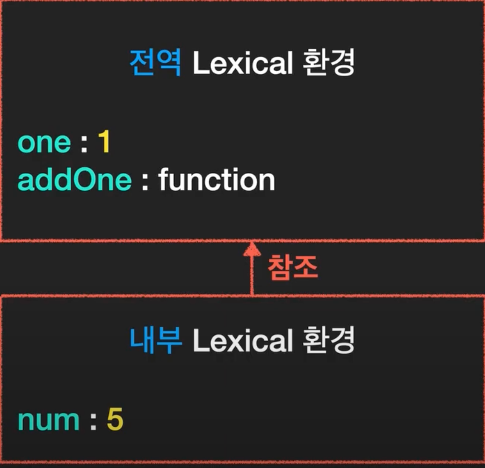
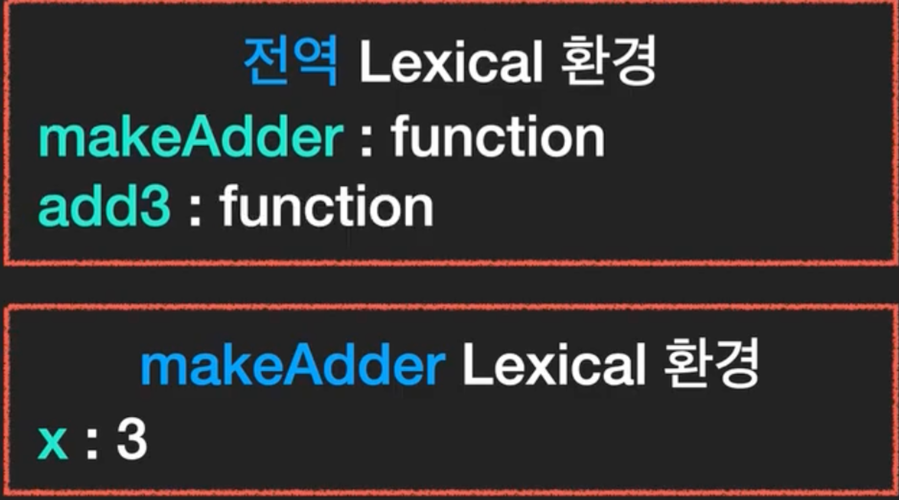

### ⚙️ 클로저(Closure)란?

> 함수와 렉시컬 환경의 조합이다. 함수가 생성될 당시의 내부 함수가 외부 변수를 기억하는것. 생성된 이후에도 계속 접근 가능.

- 외부함수가 소멸된 이후에도 내부함수가 외부함수의 변수에 접근할 수 있다
- 함수는 함수가 태어난 환경을 기억한다.
  </br>

### ⚙️ 자바스크립트는 어휘적 환경을 갖는다

`addOne` 에는 매개변수와 지역변수를 갖는다.
함수가 호출되는 동안 변수는 **내부** Lexcial → 외부 → **전역** Lexical 참조한다
one 과 num은 내부를 참조 → 없다면 외부를 참조

```js
let one;
one = 1;

function addOne(num) {
  console.log(one + num);
}

addOne(5); // 6
```



---

- add3이 실행될 때 makeAdder가 실행되고 makeAdder에 Lexical 환겨이 생성.
- x의 값이 들어간다. 함수의 Lexical 환경에는 넘겨받은 매개변수와 지역번수들이 저장된다.
- add3 은 return 하는 함수가 저장이된다.

```js
function makeAdder(x) {
  return function (y) {
    return x + y;
  };
}

const add3 = makeAdder(3);
```



---

- 위에 코드와 달리 console.log(add3(2)) 가 추가가 되었다.
- 이 때 Lexcial 함수가 또 생성이 된다. console.log 는 이 때 x와 y를 찾게된다.
- 내부→외부→전역을 돌게된다.

```js
function makeAdder(x) {
  return function (y) {
    return x + y;
  };
}

const add3 = makeAdder(3);
console.log(add3(2));
```

이런 환경을 **“클로저(Closure)”** 라고 한다.

---

### ref

- [코딩앙마 - Closure](https://www.youtube.com/watch?v=tpl2oXQkGZs)

- [코어 자바스크립트 - Closure](https://ko.javascript.info/closure)
