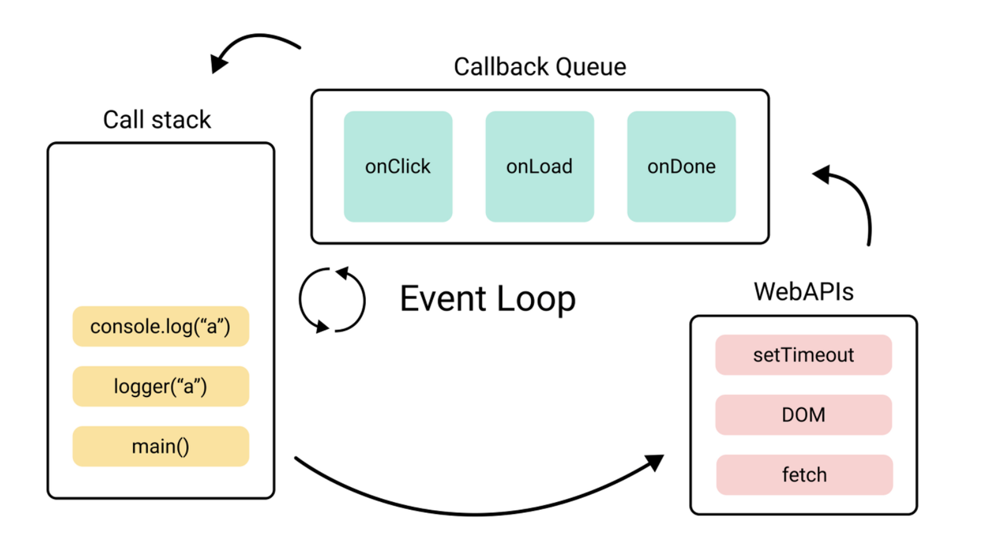

## ⚙️ 이벤트루프

### 이벤트 루프는 브라우저 동작을 제어하는 관리자

싱글 스레드인 자바스크립트의 작업을 멀티 스레드로 돌려 작업을 동시에 처리 시키게 하던가, 또는 여러 작업 중 어떤 작업을 우선으로 동작시킬 것인지 결정하는 세심한 컨트롤을 하기 위해 존재하는 것이 바로 이벤트 루프이다.

이벤트 루프는 브라우저 내부의 `Call Stack`, `Callback Queue`, `Web APIs` 등의 요소들을 모너티랑하면서 비동기적으로 실행되는 작업들을 관리하고, 이를 순서대로 처리하여 프로그램의 실행 흐름을 제어하는 녀석이다. 간단히 표현하자면 **브라우저의 동작 타이밍을 제어하는 관리자**라고 보면 된다.

이벤트 루프의 동작 과정을 간단히 살펴보자면, 자바스크립트의 `setTimeout` 이나 `fetch`와 같은 비동기 자바스크립트 코드를 브라우저 `Web APIs`에게 맡기고, 백그라운드 작업이 끝난 결과를 콜백 함수 형태로
큐(`Callback Queue`)에 넣고 처리 준비가 되면 콜스택(Call Stack)에 넣어 마무리 작업을 진행한다.
 

이러한 이벤트 루프를 이용한 프로그램 방식을 이벤트 기반 (Event Driven) 프로그래밍이라고 한다. 이벤트 이반 프로그래밍은 프로그램의 흐름이 이벤트에 의해 결정되는 방식이다. 예를 들어 사용자의 클릭이나 키보드 입력과 같은 이벤트가발생하면, 그에 맞는 콜백 함수가 실행된다. 대표적으로 자바스크립트addEventListener(이벤트명,콜백함수)가 있겠다.

### ⚙️ 콜스택

- 콜스택(Call Stack)은 실행된 코드의 환경을 저장하는 자료구조로, 함수 호출 시 이곳에 저장됩니다. 어떤 함수를 저장하면 스택에 쌓고 또 다른 함수를 호출하면 그 다음 스택에 쌓이면서 가장 위에 쌓인 함수를 가장 먼저 처리합니다. LIFO(Last In First Out)

### ⚙️ webAPI

- Web API는 브라우저에서 제공하는 API로 DOM, Ajax, TimeOut 등이 있습니다. CallStack에서 실행된 비동기 함수는 Web API를 호출하고, Web API는 콜백 함수를 Task Queue에 넣습니다.

### ⚙️ 콜백큐

- 콜백큐(Callback Queue)는 함수를 저장하는 자료구조로, Call Stack과 다르게 가장 먼저 들어온 함수를 가장 먼저 처리합니다.

### ref

[Inpa Dev - 이벤트루프](https://inpa.tistory.com/entry/%F0%9F%94%84-%EC%9E%90%EB%B0%94%EC%8A%A4%ED%81%AC%EB%A6%BD%ED%8A%B8-%EC%9D%B4%EB%B2%A4%ED%8A%B8-%EB%A3%A8%ED%94%84-%EA%B5%AC%EC%A1%B0-%EB%8F%99%EC%9E%91-%EC%9B%90%EB%A6%AC)
